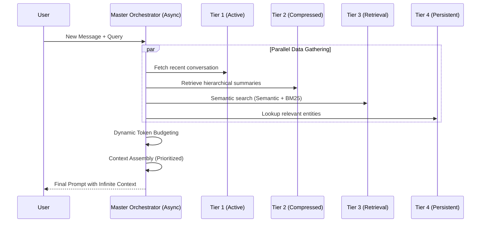

# 🏗️ Deep-Dive Architecture

The **Infinite Context System (ICS)** is an advanced orchestration layer designed to handle Large Language Model (LLM) context windows that scale horizontally with external storage while maintaining the low-latency response times of local memory.

---

## 🗺️ High-Level System Flow

The core of ICS is the **Master Orchestrator**, which acts as a traffic controller between the user query and the memory tiers.



---

## 🧠 Tier Deep-Dives

### Tier 1: Active Context (Sliding Window)
- **Implementation**: `tier1_active_context.py`
- **Logic**: Maintains a FIFO (First-In-First-Out) queue of the most recent messages.
- **Persistence**: Periodically flushes to local disk via `aiofiles` to ensure no data loss between restarts.
- **Overflow**: When T1 fills up, the oldest messages are sent to **Tier 2** for compression.

### Tier 2: Compressed Memory (Hierarchical)
- **Implementation**: `tier2_compressed_memory.py`
- **Logic**: Uses LLM-based abstractive summarization.
- **Compression Density**:
  - **Ultra**: Extreme compression for high-level history.
  - **Mid**: Balanced context for recent history.
  - **Detailed**: High-fidelity recall for critical events.

### Tier 3: Vector Retrieval (Global Knowledge)
- **Implementation**: `tier3_vector_retrieval.py`
- **Primary Engine**: **Qdrant** (Vector Database).
- **Fallback Engine**: Local **In-Memory COSINE Similarity**.
- **Search Strategy**: Uses **Hybrid Search** (Dense Vector + Sparse Keyword) to Ensure both semantic meaning and keyword accuracy are captured.

### Tier 4: Persistent Memory (Entity Graph)
- **Implementation**: `tier4_persistent_memory.py`
- **Primary Engine**: **Neo4j** (Graph Database).
- **Fallback Engine**: `EntityMemoryGraph` (Local dict-based graph).
- **Intelligence**: An LLM-driven extractor parses every message for entities (People, Projects, Places) and their relationships, allowing the system to remember "Who is Sarah?" even after months of silence.

---

## ⚡ Asynchronous Engine
ICS is built on `asyncio`. Every tool, from vector search to file I/O, is non-blocking. This allows the system to process massive knowledge bases without stalling the main execution thread.

## 🛡️ Resilience & Safety
Each tier follows a **Resilience First** pattern:
```python
try:
    results = await self.external_db.search(query)
except ConnectionError:
    results = await self.in_memory_fallback.search(query)
```
This ensures that the `generate_context` call **always** returns values, even if your infrastructure is partially down.

---

## 📊 Token Budget Allocation
The Orchestrator uses a weighted priority system to fill the LLM's context window:
1.  **System Message**: 100% Priority
2.  **Tier 1 (Active)**: 1.0 Weight
3.  **Tier 4 (Entities)**: 0.8 Weight
4.  **Tier 2 (History)**: 0.6 Weight
5.  **Tier 3 (Knowledge)**: 0.4 Weight

---
**ICS Architecture v2.0**
