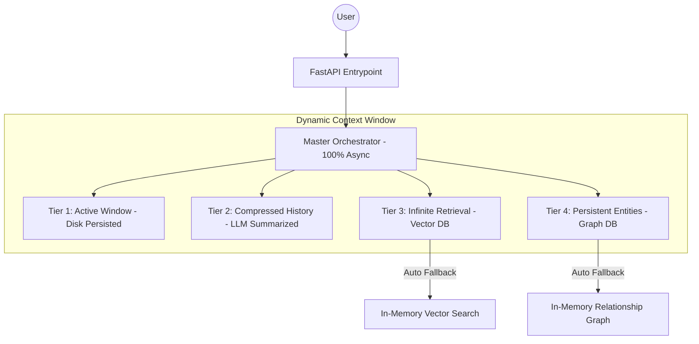

# 🌌 Infinite Context System (ICS)

[](https://fastapi.tiangolo.com/)
[](https://openai.com/)
[](https://modelcontextprotocol.io)
[](https://github.com/rjbizsolution23-wq/infinite-context-system/actions)
[](https://opensource.org/licenses/MIT)

> **The ultimate multi-tier context management framework for LLMs and AI Agents. Eliminate context limits with intelligent orchestration, semantic retrieval, and graph-based memory.**

---

## 📖 Essential Guides
*   **[Core Architecture](ARCHITECTURE.md)**: Deep dive into the 4-tier memory model.
*   **[MCP Mastery Guide](MCP_GUIDE.md)**: How to maximize the Model Context Protocol tools.
*   **[Installation & Setup](INSTALL.md)**: Standard setup instructions.

---

## 💎 The "Unlimited" Vision

Modern LLMs are bound by fixed context windows. **ICS** breaks these barriers using a biologically-inspired, 4-tier memory architecture that combines immediate focus with infinite long-term recall.

### 🛡️ Engineered for Resilience
Unlike basic RAG implementations, **ICS is built for production stability**. It features **Robust Fallbacks**: if your external databases (Qdrant, Neo4j) are unreachable, the system automatically switches to high-performance in-memory engines. **Your agent never loses its memory.**

---

## 🔌 MCP Integration (Model Context Protocol)

ICS is a fully-featured **MCP Server**, allowing it to be used as a set of tools by any MCP-capable agent (like Claude Desktop).

### Exposed Tools:
*   `ingest_knowledge`: Add new background documents.
*   `query_memory`: Retrieve consolidated context across all tiers.
*   `remember_relationship`: Manually inject graph relationships.
*   `get_system_health`: Monitor memory utilization.

### Usage with Claude Desktop:
Add this to your `claude_desktop_config.json`:
```json
"mcpServers": {
  "infinite-context": {
    "command": "python",
    "args": ["/path/to/mcp_server.py"],
    "env": {
      "OPENAI_API_KEY": "your-key-here"
    }
  }
}
```

---

## 🏗️ 4-Tier Hybrid Architecture



### 🧠 The Memory Tiers
| Tier | Capability | Technology | Capacity |
| :--- | :--- | :--- | :--- |
| **Tier 1** | **Active Focus** | `aiofiles` JSON Storage | 32K Tokens |
| **Tier 2** | **Short-Term History** | Hierarchical LLM Compression | 50K Tokens |
| **Tier 3** | **Global Knowledge** | Qdrant / In-Memory Fallback | Unlimited |
| **Tier 4** | **Entity Awareness** | Neo4j / In-Memory Graph | Long-Term |

---

## ✨ Features

- ⚡ **100% Asynchronous**: Built from the ground up with `asyncio` for non-blocking, high-performance execution.
- 🛡️ **Zero-Downtime Resilience**: Seamless in-memory fallbacks ensure functionality even when databases are offline.
- 🔍 **Hybrid Retrieval**: Combines Dense Vector (Semantic) and Sparse (BM25) search with intelligent reranking.
- 📈 **Autonomous Entity Extraction**: Automatically builds knowledge graphs from conversation flow using LLMs.
- 🚀 **FastAPI Ready**: Integrated REST API for plug-and-play deployment.
- 📦 **Docker Optimized**: Production-ready containerization included.

---

## 🚀 Quick Start

### 1. Installation
```bash
git clone https://github.com/youruser/infinite-context-system.git
cd infinite-context-system
python -m venv venv && source venv/bin/activate
pip install -r requirements.txt
```

### 2. Environment Setup
```bash
export OPENAI_API_KEY='your-key'
# Optional: ICS will auto-fallback to in-memory if these are missing
export QDRANT_URL='http://localhost:6333'
export NEO4J_URI='bolt://localhost:7687'
```

### 3. Run the Resilience Smoke Test
```bash
python smoke_test.py
```

### 4. Start the API
```bash
uvicorn main:app --reload
```
Visit `http://localhost:8000/docs` to interact with your infinite context engine!

---

## 📖 System Explanation

### Dynamic Token Budgeting
ICS doesn't just "stuff" context. The **Orchestrator** dynamically calculates a token budget for every request, prioritizing Tier 1 (recency) and Tier 4 (identity) while intelligently filling the remaining gap with relevant background from Tiers 2 and 3.

### Biological Memory Model
*   **Sensory (T1)**: Immediate sliding window.
*   **Short-term (T2)**: Summarized concepts.
*   **Long-term (T3)**: Vast external libraries.
*   **Episodic (T4)**: Who is the user? What are their preferences?

---

## 🛠️ Advanced Configuration (`config.py`)
Fine-tune your memory allocations to match your LLM's primary context window:
```python
config.tier_configs[ContextTier.ACTIVE].max_tokens = 64000
config.retrieval_strategy = "hybrid"  # Maximize accuracy
```

---

## 📝 License
Distributed under the **MIT License**. See `LICENSE` for more information.

## 🤝 Contributing
Built for the AI community. Pull requests for new vector DB connectors or compression strategies are encouraged!

---
**Infinite Context System** — Because agents should never forget.
