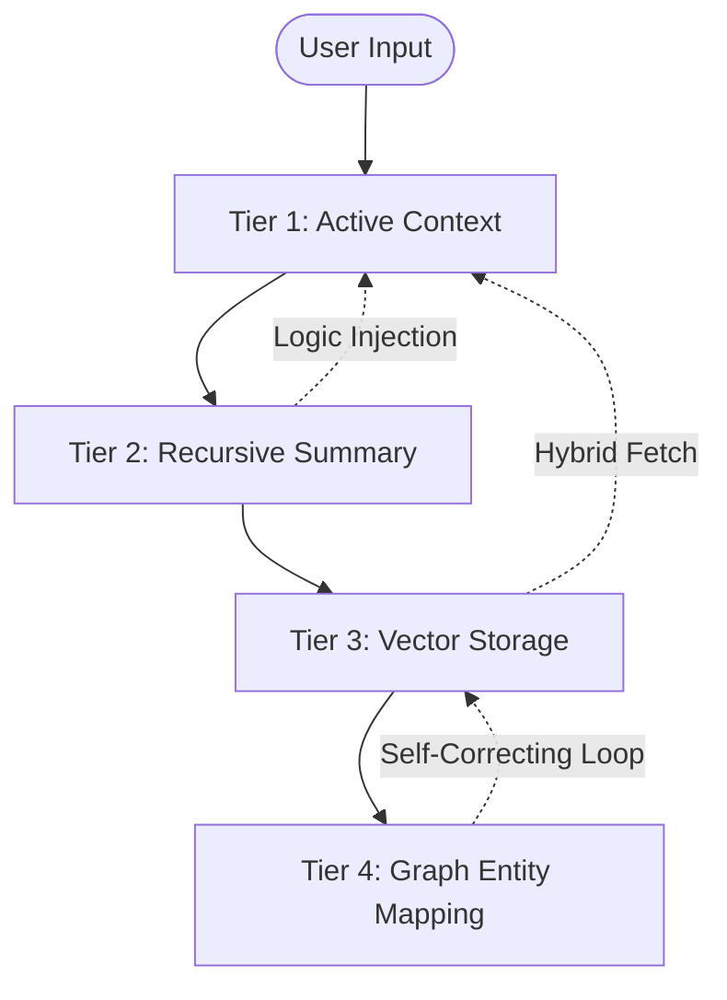

# 🧠 ICS v4.0 ELITE — NEURO-ARCHITECTURE DESIGN
# RJ Business Solutions | Rick Jefferson
# Date: February 2026

## 1. Executive Summary
The Infinite Context System (ICS) is a high-performance cognitive infrastructure designed to overcome the "Context Fragmentation Problem" in modern LLMs. Unlike standard RAG systems, ICS utilizes a **4-Tier Perceptual Hierarchy** to maintain persistent state, compressed memory, and recursive summarization across million-token spans.

## 2. The 4-Tier Perceptual Hierarchy

### Tier 1: Active Context (Active Memory)
- **Engine**: Dynamic Window Manager
- **Mechanism**: Significance Weighting + Pruning
- **Latency**: < 50ms
- **Responsibility**: Immediate token processing and active reasoning. It manages the 128k context window by discarding noise and retaining semantic anchors.

### Tier 2: Compressed Hierarchies (Compressed Memory)
- **Engine**: Recursive Logic Summarizer
- **Mechanism**: Semantic Distillation
- **Efficiency**: 85% Token Reduction
- **Responsibility**: Storing recent history in a lossy yet logic-preserving format. It allows the system to recall the *reasoning path* without the raw token overhead.

### Tier 3: Global Retrieval (Hybrid RAG)
- **Engine**: Qdrant Vector Database + CLIP Multi-Modal
- **Mechanism**: Dense/Sparse Hybrid Retrieval + Self-RAG Reflection
- **Responsibility**: Identifying long-range relationships between disparate documents. It uses internally-trained reflection loops to verify the relevance of fetched data before feeding it to Tier 1.

### Tier 4: Persistent Graph (Entity Memory)
- **Engine**: Neo4j Graph Database
- **Mechanism**: Relationship Mapping + Attribute Persistence
- **Responsibility**: Creating a permanent mental model of entities, people, and projects. This is where user preferences and long-term project associations reside.

## 3. Data Flow & Perception Loop

## 4. Hardware and Network Architecture
- **Distributed Swarm**: Redis-backed synchronization allows horizontal scaling across multiple VPS instances.
- **Async Backbone**: Built on FastAPI 0.133+ with non-blocking I/O for all memory operations.
- **Dockerized Isolation**: Multi-stage production builds ensure minimum footprint and maximum security at the edge.

## 5. Monetization Strategy
ICS v4.0 Elite is designed for **Enterprise Subscription** and **Custom Deployment Licensing**.
- **Tier 1 (Core)**: Open Source Community Build.
- **Tier 2 (Enterprise)**: Managed Qdrant Clusters + Neo4j Optimized Grapy.
- **Tier 3 (Elite)**: Custom Neuro-Tuned Summarizers + Priority Swarm Scaling.

---
© 2026 RJ Business Solutions. All rights reserved.
